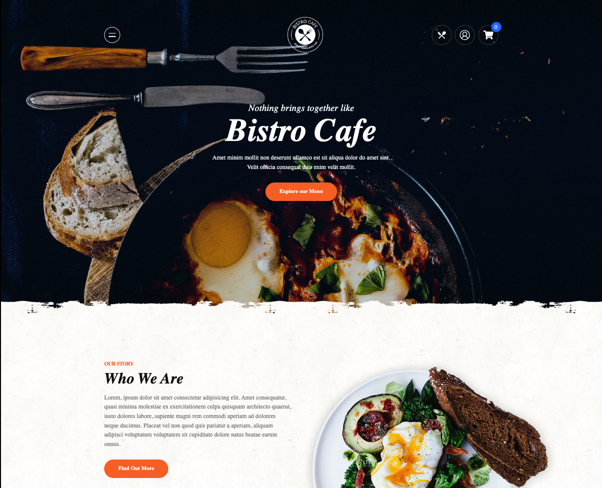

# Bristo-Cafe Ecommerce Project

> The Ecommerce website is designed with good responsiveness and animations, ensuring that it works equally well on both desktop and mobile devices. The data is fetched from MealDB Api for the food items listed. The state is managed through Redux for purchasing products through cart checkout.

## ⚒️  Built with

- Html
- Css
- JavaScript

## 🎞️ Frameworks and Technologies used

- Tailwindcss
- Framer Motion
- React
- Redux-toolkit

## 🖥️ Live Demo
- [Demo](https://bistro-cafe-ecommerce-ukesh.vercel.app/) :point_left:

## 🤝 Contributing

Contributions, issues, and feature requests are welcome!

## Show your support

Give a ⭐️ if you like this project!

## Acknowledgments

- [TheMealDB](https://www.themealdb.com/api.php) for the external API used in the project
